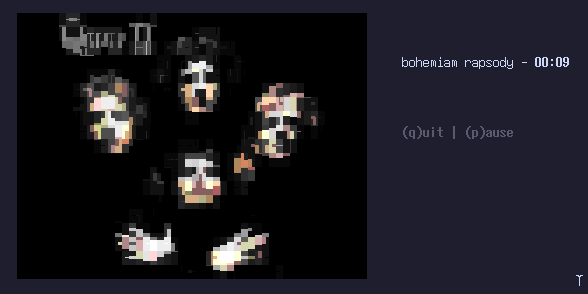

<p align="center">
    
</p>

<h6 align="center">
Suckless TUI YouTube-Music Player
    </h6>

<h1></h1>

<br>

<div style="display: inline;" align="center">
    <a href="https://github.com/rdWei/rdWei/blob/main/donate.MD">
        Support Me
    </a>
</div>

<br>

<p align="center">
    
</p>

### Table of Contents

- [Dependencies](#dependencies)
- [Compile](#compile)
- [Usage](#usage)
- [TODO](#todo)
- [Contributing](#contributing)

### Dependencies

To run this application, you need to install the following dependencies:

- `mpv` - A versatile media player.
- `chafa` - A command-line tool for converting images to ASCII/ANSI art.
- `yt-dlp` - A YouTube video downloader with additional features.

### Compile

```bash
mkdir build
cd build
cmake ..
make
./mousice bohemian_rhapsody
```

### Usage
`./mousice bohemian_rhapsody`

### TODO
- Add playlist support
- Handle songs end

### Contributing
If you'd like to contribute, you can submit a [pull request](https://github.com/rdWei/C-rypt/pulls) with your changes or open an [issue](https://github.com/rdWei/C-rypt/pulls) to report any problems or feature requests.
